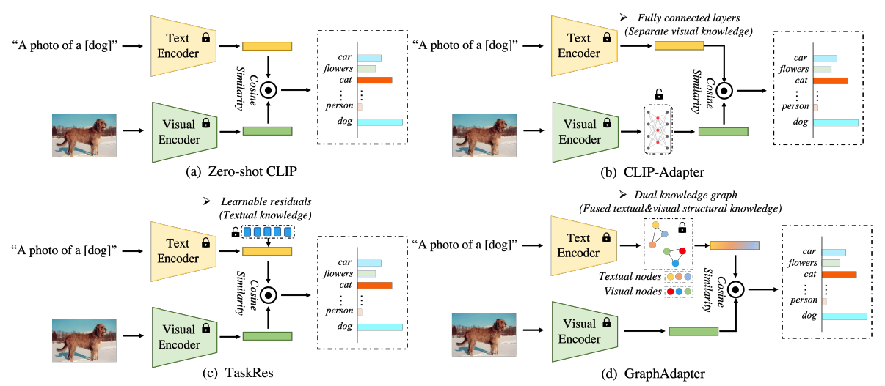

[GraphAdapter](https://github.com/lixinustc/GraphAdapter/assets/92313416/624d7b0f-7e50-4e9b-b987-76b9316e81b5)


# GraphAdapter: Tuning Vision-Language Models With Dual Knowledge Graph
The efficient tuning method for VLMs

[Xin Li](http://home.ustc.edu.cn/~lixin666/), [Dongze Lian](), [Zhihe Lu](), [Jiawang Bai](), [Zhibo Chen](https://scholar.google.com/citations?user=1ayDJfsAAAAJ&hl=en) and [Xinchao Wang]()

University of Science and Technology of China (USTC), National University of Singapore (NUS)

[](https://arxiv.org/abs/2309.13625)

##  :bookmark:  New!!!
| 2023-09-26  | The Arxiv version has been released | 

| 2023-12-09  | Then basic code starts to be released |

| 2024-03-10  | Full code has been initially released |

<p align="center">
  
</p>


## 📌 Cite US 
If this work is helpful to you, please cite us:
```
@article{li2024graphadapter,
  title={Graphadapter: Tuning vision-language models with dual knowledge graph},
  author={Li, Xin and Lian, Dongze and Lu, Zhihe and Bai, Jiawang and Chen, Zhibo and Wang, Xinchao},
  journal={Advances in Neural Information Processing Systems},
  volume={36},
  year={2024}
}
```


## Acknowledges
The code is implemented based on the excellent work [CoOp](https://github.com/KaiyangZhou/CoOp)
